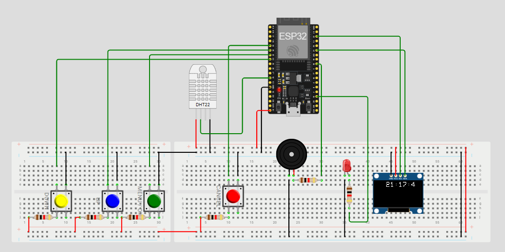
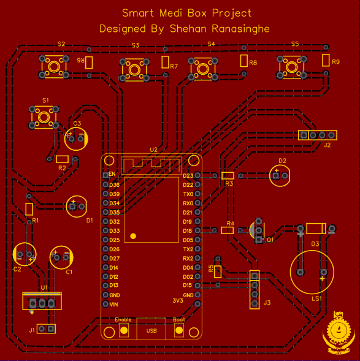
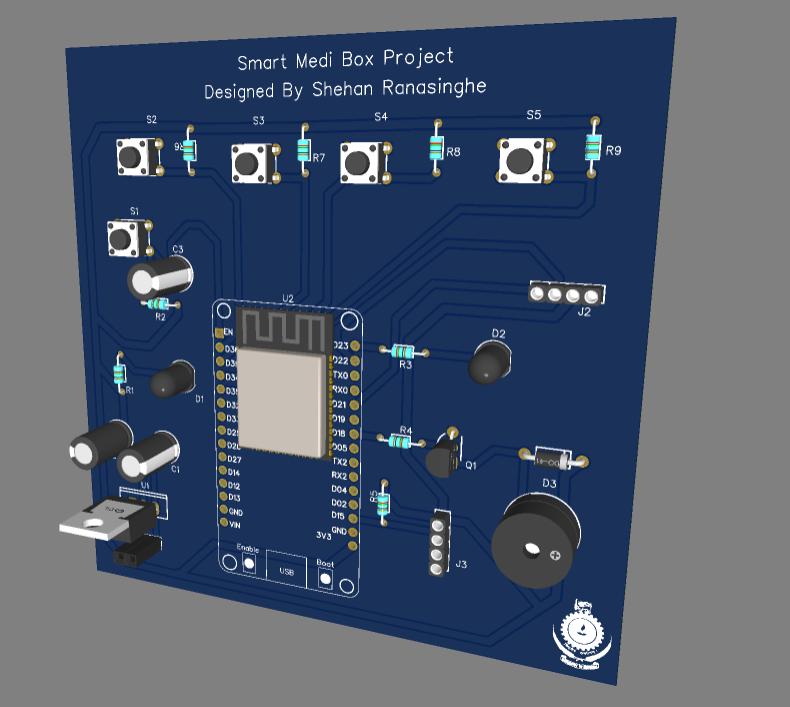

#  Smart MediBox – Intelligent IoT Medication Management


---

##  Introduction

Managing medications can be challenging, especially for individuals who need to take multiple doses at different times of the day. Forgetting even a single dose can reduce the effectiveness of treatment or lead to health complications. Traditional pillboxes are passive and do not provide reminders, monitoring, or remote connectivity.

**Smart MediBox** was created to solve this problem. It is an intelligent pharmaceutical storage system that **not only reminds patients to take their medication** but also **monitors the storage environment** to ensure medicine quality is maintained. With IoT integration, it allows **remote monitoring, real-time alerts, and complete control from anywhere**.

This project combines **embedded systems, IoT communication, environmental sensing, and user interface design** into one compact solution.

 **See it in action:** 🎥 [Watch Project Videos](https://drive.google.com/drive/folders/1JH7f_IJpU5T4b4XAAQsOsxm_KyHcqEqf?usp=drive_link)


---
### Wokwi Simulation


---

##  Why Smart MediBox?

*  **Never miss a dose** – Intelligent alarm system keeps you on schedule.
*  **Store medicines safely** – Built-in temperature and humidity monitoring warns if conditions are unsafe.
*  **Environment-aware** – Automated shading adjusts light exposure, protecting sensitive medications.
*  **Stay connected** – IoT dashboard for remote access and real-time insights.
*  **No data loss** – Alarms and settings are saved in EEPROM, so even after a restart, the system remembers.

---

##  Features in Depth

###  Smart Time & Alarms

* Automatic **NTP time synchronization** (accurate global time, with time zones).
* Set multiple alarms for different medications.
* Alarms trigger **buzzer + OLED notifications**.
* User-friendly navigation with **push buttons** for alarm setup.

###  Environmental Monitoring

* **DHT22 sensor** continuously tracks temperature & humidity.
* Alerts if medicine storage goes out of safe range.
* Data logged and pushed via MQTT for remote visualization.

###  Light Management

* Dual **LDR sensors** measure ambient light intensity.
* Servo controlled shade automatically adjusts exposure.
* Manual override available via IoT dashboard.

##  Custom PCB Design  

To ensure compactness, reliability, and long-term usability, a **custom PCB** was designed using **EasyEDA**.  
Instead of relying on jumper wires and breadboards, the PCB integrates all core components of the MediBox in a single board, improving durability and reducing wiring complexity.  

###  Key Highlights:
* Designed in **EasyEDA** with proper schematics and PCB layout.  
* Compact footprint for enclosure-friendly design.  
* All sensor and actuator pins are clearly labeled for easy debugging.  
* Power distribution optimized for ESP32, sensors, and actuators.  
* Integrated connectors for OLED, DHT22, LDRs, Servo, and Buzzer.  
* Gerber files exported for fabrication, making it manufacturable.





###  IoT & Dashboard Integration

* Real-time communication via **MQTT protocol**.
* Node-RED dashboard with:

  *  Temperature & humidity graphs
  *  Light monitoring
  *  Servo control
  *  Alarm indicators
  *  Historical data logs
  *  Mobile-responsive design

###  Efficiency & Reliability

* Smart power management – no unnecessary updates if values don’t change.
* EEPROM ensures **persistent storage** of user settings.
* Works continuously, **24/7 monitoring**.

---

##  Hardware Used

* **ESP32 Development Board** – Main IoT controller
* **128x64 OLED Display** – User interface
* **Push Buttons (3–4)** – Navigation and selection
* **Buzzer** – Alarm alerts
* **DHT22 Sensor** – Temperature & humidity
* **LDRs (2x)** – Light detection
* **Servo Motor (SG90)** – Automated shading mechanism
* **EEPROM** – Non-volatile memory
* **Resistors & jumper wires** – Supporting circuitry

---

##  Software Stack

* **Programming:** Arduino IDE / PlatformIO
* **Simulation:** [Wokwi](https://wokwi.com/) for virtual testing
* **IoT Dashboard:** Node-RED
* **Broker:** Mosquitto MQTT
* **Key Libraries:**

  * WiFi Management
  * OLED Display Driver
  * DHT22 Sensor Library
  * Servo Motor Control
  * MQTT Client
  * NTP Time Sync

---

##  System Overview

```
┌───────────── Smart MediBox ──────────────┐
│                                          │
│   OLED + Buttons + Buzzer (User Alerts)  │
│             │                            │
│     ┌───────┴────────┐                   │
│     │ ESP32 Control  │  <── MQTT ──>  Node-RED Dashboard
│     └───────┬────────┘                   │
│             │                            │
│   ┌─────────┼─────────┐                  │
│   │         │         │                  │
│ DHT22     LDRs     Servo Motor           │
│(Env. Mon) (Light)  (Shade Control)       │
│                                          │
└──────────────────────────────────────────┘
```

---

##  Node-RED Dashboard Preview

✔ Real-time graphs of temperature & humidity
✔ Light intensity monitoring
✔ Alarm status indicators
✔ Remote servo motor control
✔ Data history & logs
✔ Mobile-friendly layout

---

##  How to Use

1. **Power on the MediBox** – ESP32 connects to Wi-Fi & syncs time via NTP.
2. **Set Alarms** – Navigate with buttons → Select time & days → Save.
3. **Monitor Environment** – OLED shows live status, dashboard logs data.
4. **Respond to Alerts** – Buzzer + OLED notify when it’s time to take meds.
5. **Remote Control** – Use Node-RED to monitor & control from anywhere.

---

##  Future Plans

*  **Mobile App** for direct user notifications
*  **Voice Assistant Integration** (Alexa, Google Assistant)
*  **AI-based usage pattern learning**
*  **Multi-compartment support** for different medications
*  **Pharmacy system integration** for auto-refill alerts
*  **Enhanced security** with authentication & encryption

---


